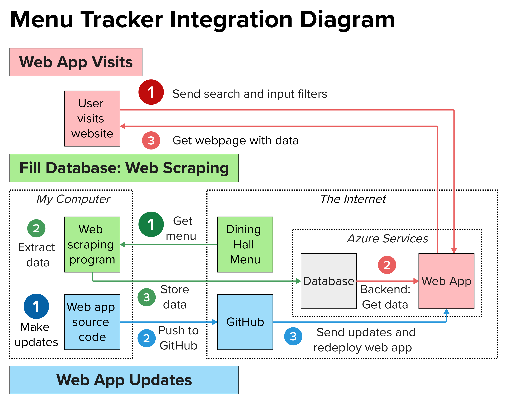

# Menu Tracker

Menu Tracker is a web app that displays the upcoming availabilities of foods from UT Austin Dining Halls and offers multiple filters to refine results. [Visit Menu Tracker now!](https://menu-tracker-btbwf7bufydxbuds.canadacentral-01.azurewebsites.net/) 

### Motivation
I'm always devestated when I miss the time that my favorite food, brisket, is served at the dining hall. With Menu Tracker, I’ll know when brisket is available so that I'll never miss it again! 

Menu Tracker is my first experience with full stack development. I explored web scraping, website development, database management, and using cloud computing services. I learned SQL and improved my Python, HTML, and CSS skills. (Thank you YouTube tutorials!)

## How Does It Work?

There are two main parts: the app and the database. Web scraping fills the database. The web app is deployed with a cloud computing service. See [Overview](./OVERVIEW.md) for a detailed description of how each component works.

### Web Scraping
Web scraping fills the database with data from the online dining hall menus. It:
* Gets the web page of the dining hall menu
* Scrapes the data from its HTML file
* Stores the data into the database
* Is automated to run daily from my computer

### Web App
The frontend contains the webpages that the users see. The backend framework connects the frontend to the backend. The backend uses data sent by users to send data from the database back to the user.
#### Frontend
* Backend framework constructs HTML files that display webpage content
* Uses CSS to style content
#### Backend Framework
* Defines routes
* Sends received search input and filters to the backend
* Gets the search result data from the backend
* Renders webpages using the search result data
#### Backend
* Gets search input and selected filters from the backend framework
* Builds SQL query and gets data from database
* Passes search result data to the backend framework

### Cloud Services
Cloud services store Menu Tracker resources so that it is available on demand, independent of my computer.
* Azure Web App deploys Menu Tracker as a web app
* Azure SQL Server and Azure SQL Database stores data 
* Azure Virtual Network allows the web app to access the database